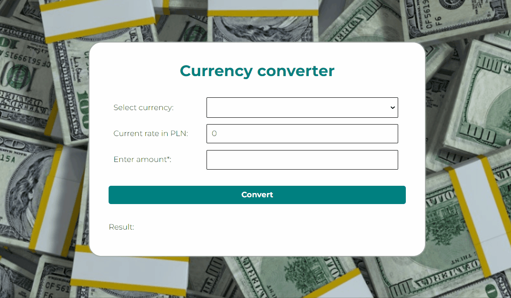

# Currency converter

## Table of content
- [Demo](#Demo)
- [General info](#general-info)
- [How it works?](#how-it-works)
- [Technologies/Conventions I used](#TechnologiesConventions-I-used)

## Demo
https://galerafrontend.github.io/currency-converter/

## General info
This project is a simple example of currency converter. The converter is easy and plessent to use as well as you need only 3 steps to convert selected currency.

## How it works?
1. At first select any currency from displayed list.

    As you can see the current rate will be set automatically in PLN depending on the selected currency.

2. At second enter any amount in selected currency in the field.
Remember that the field must be filled in otherwise the form will remind about it.

3. At third, click a button and converted amount will be shown below. 

4. An example of project's operation has been presented on the GIF.

## Technologies/Conventions I used
Project is created with:
- BEM
- media queries
